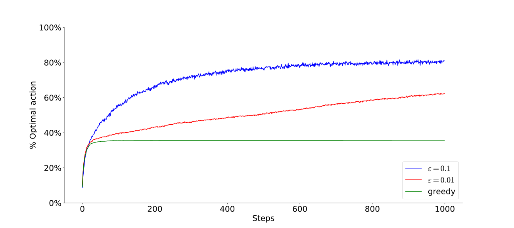

`figs/` folder contains figures\
`func/` folder contains procedural implementation\
`oop/` folder contains object oriented implementation

The code in procedural style is redundant, but runs faster as function calls in python take some time.
It becomes significant in exercise 2.11, where you have to make 200 000 steps for each run.

OOP implementation is included for comparison. There is a [demo.ipynb](oop/demo.ipynb) jupyter notebook for demonstration of Bandit objects usage.

### Figure 2.2

[fig2_2.py](func/fig2_2.py)
