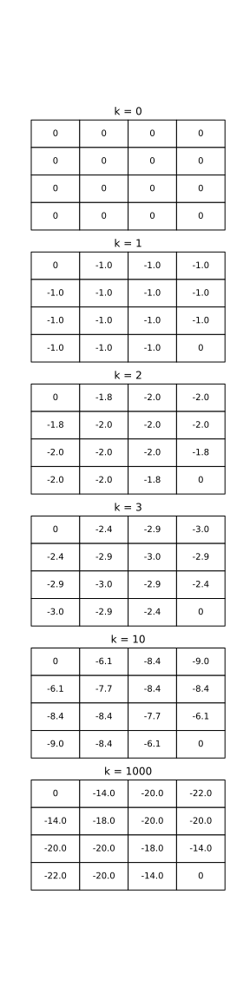
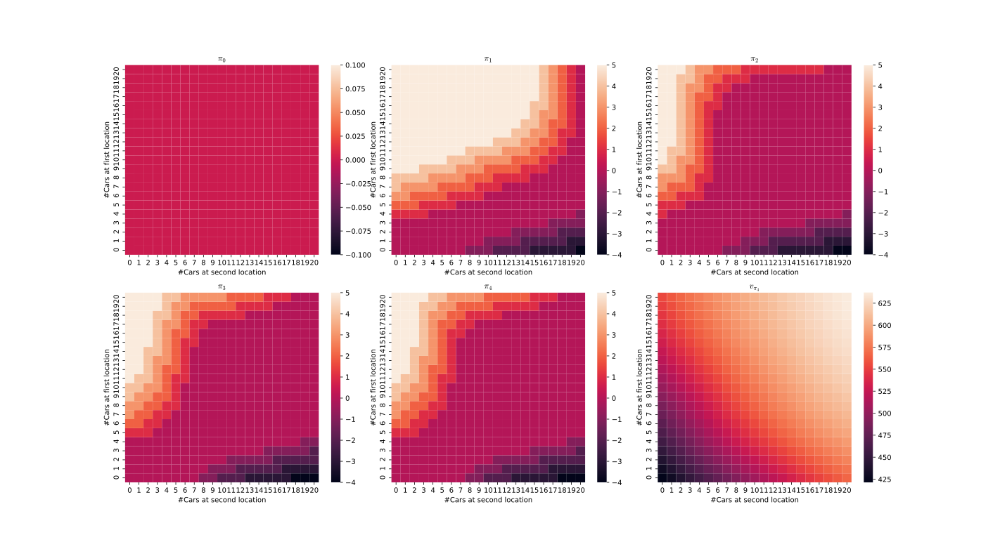
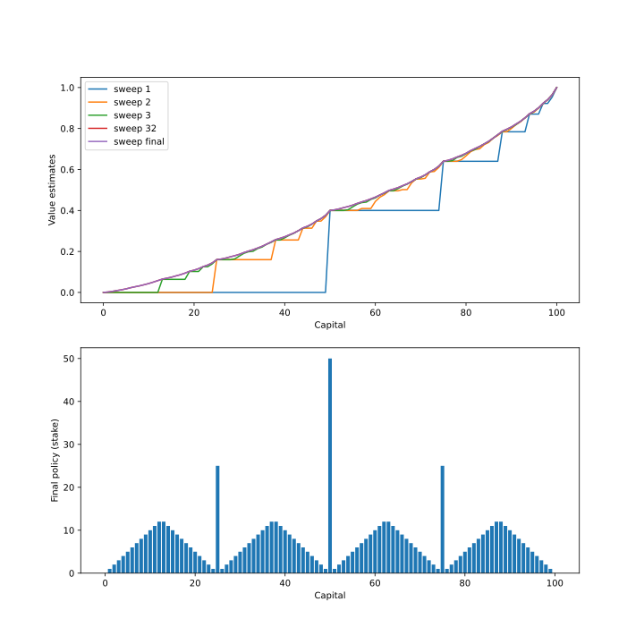
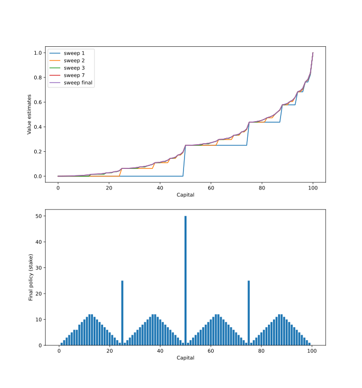
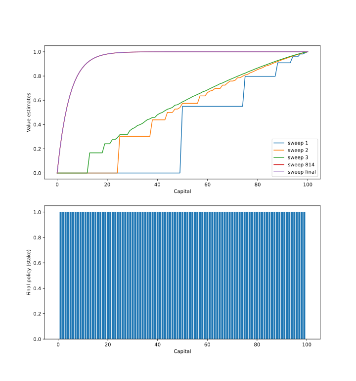

# Figure 4.1 (left row, policies omitted)

[fig4_1.py](fig4_1.py), [fig4_1.ipynb](fig4_1.ipynb)

# Figure 4.2
Detailed analysis of the problem in Aditya Rastogi's blogpost 
[Elucidating Policy Iteration in Reinforcement Learning — Jack’s Car Rental Problem](https://towardsdatascience.com/elucidating-policy-iteration-in-reinforcement-learning-jacks-car-rental-problem-d41b34c8aec7)

His repo https://github.com/thunderInfy/JacksCarRental

Good ideas how to speed up code execution in Yang Zhang's repo https://github.com/zy31415/jackscarrental

[fig4_2.py](fig4_2.py), for explanations please see jupyter notebook [fig4_2.ipynb](fig4_2.ipynb)

# Figure 4.3
An excellent explanation on the family of optimal policies in vojtamolda's [repo](https://github.com/vojtamolda/reinforcement-learning-an-introduction/blob/main/chapter04/chapter04.pdf)

How to replicate policy plot from the RL book https://github.com/ShangtongZhang/reinforcement-learning-an-introduction/issues/83

Some experiments with policies in James Teow's blog https://medium.com/@jaems33/gamblers-problem-b4e91040e58a

[fig4_3.py](fig4_3.py), [fig4_3.ipynb](fig4_3.ipynb)

# Exercise 4.9
p = 0.25

p = 0.55

Code is the same as for figure 4.3 ([fig4_3.py](fig4_3.py)).

