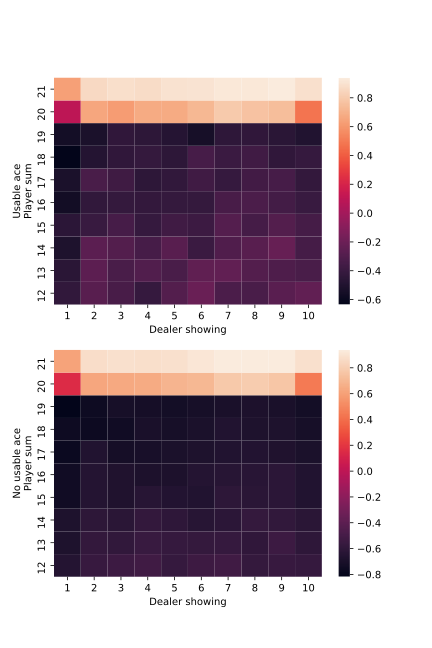
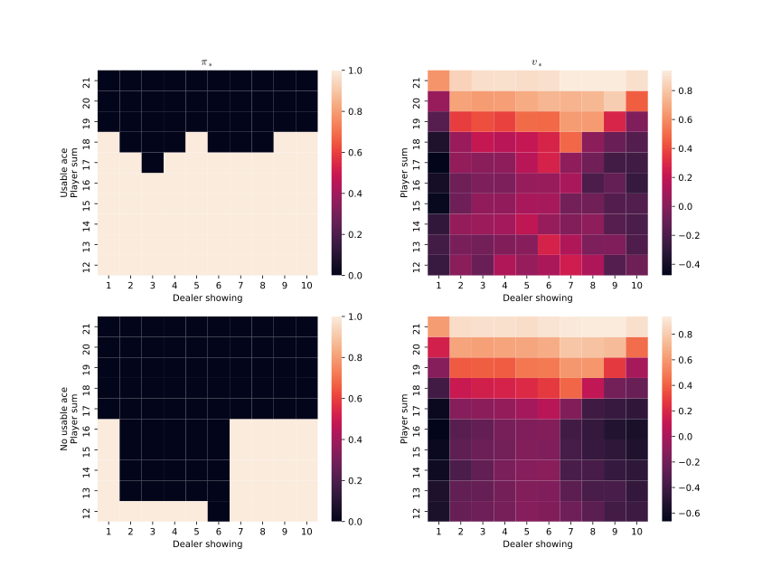

# Figure 5.1
[fig5_1.py](fig5_1.py)

|After 10 000 episodes        |  After 500 000 episodes   
|:---------------------------:|:----------------------------:
| |

# Figure 5.2
[fig5_2.py](fig5_2.py)

# Figure 5.3
[fig5_3.py](fig5_3.py)

# Figure 5.4

Not enough RAM for 100M steps

[fig5_4.py](fig5_4.py)

# Figure 5.5
[ex5_12_demo.ipynb](ex5_12_demo.ipynb)

[ex5_12.py](ex5_12.py)

| |
|:---------------------------:|:----------------------------:
|Figure 5.5a        |  Figure 5.5 b  
