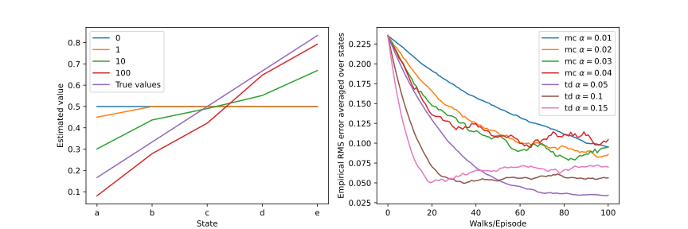

# Example 6.2
[example6_2.py](example6_2.py)

# Figure 6.2
[fig6_2.py](fig6_2.py)

# Example 6.5
[example6_5.py](example6_5.py)

# Exercise 6.9
[exercise6_9.py](exercise6_9.py)

# Exercise 6.10
[exercise6_10.py](exercise6_10.py)

# Example 6.6
[example6_6.py](example6_6.py)

# Figure 6.3
[fig6_3.py](fig6_3.py)

