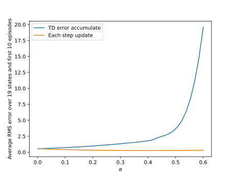

# Exercise 7.2
[exercise7_2.py](exercise7_2.py)

# Figure 7.2
[fig7_2.py](fig7_2.py)

# Figure 7.4
[fig7_4.py](fig7_4.py)

|||
:-------------------------:|:----------------------------:|:---------------:
